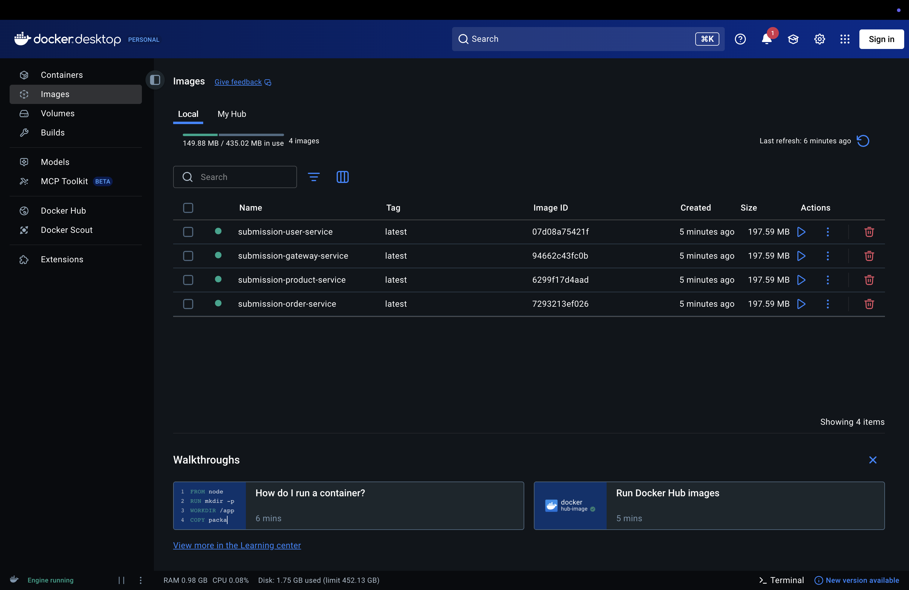

# Node.js Microservices Orchestration with Docker & Docker Compose

This repository contains the containerization and orchestration configuration files for a microservices-based application using Node.js, Express, Docker, and Docker Compose.

## Project Architecture & Services

The application consists of four Node.js microservices communicating over a shared Docker bridge network (`microservices-net`):

1. **User Service:** Runs on port `3000`. Exposes `/users` and `/health`.
2. **Product Service:** Runs on port `3001`. Exposes `/products` and `/health`.
3. **Order Service:** Runs on port `3002`. Exposes `/orders` (GET/POST) and `/health`.
4. **Gateway Service:** Runs on port `3003`. Acts as the single entry point, routing requests to internal services:
   - `/api/users` -> Routes to `User Service` (http://user-service:3000/users)
   - `/api/products` -> Routes to `Product Service` (http://product-service:3001/products)
   - `/api/orders` -> Routes to `Order Service` (http://order-service:3002/orders)

---

## File Structure

```
submission/
├── user-service/
│   ├── app.js
│   ├── package.json
│   └── Dockerfile
├── product-service/
│   ├── app.js
│   ├── package.json
│   └── Dockerfile
├── order-service/
│   ├── app.js
│   ├── package.json
│   └── Dockerfile
├── gateway-service/
│   ├── app.js
│   ├── package.json
│   └── Dockerfile
├── docker-compose.yml
├── docker_services_status.png
└── README.md
```

---

## Setup & Run Instructions

### Prerequisites
- [Docker Desktop](https://www.docker.com/products/docker-desktop/) installed and running.
- [Node.js](https://nodejs.org/) (optional, for local testing outside containers).

### Step 1: Navigate to the Submission Directory
If you have unzipped this file:
```bash
cd submission
```

### Step 2: Build and Launch Containers
To build the Docker images for all four services and start the containers in detached mode, run:
```bash
docker compose up -d --build
```

### Step 3: Verify Container Status
Check if all containers are running successfully:
```bash
docker ps
```
All containers should display a status of `Up`.

---

## Testing the Microservices

You can test the endpoints using a browser, Postman, or `curl` commands in the terminal.

### 1. Test Individual Service Health Checks
- **User Service:**
  ```bash
  curl http://localhost:3000/health
  # Expected: {"status":"User Service is healthy"}
  ```
- **Product Service:**
  ```bash
  curl http://localhost:3001/health
  # Expected: {"status":"Product Service is healthy"}
  ```
- **Order Service:**
  ```bash
  curl http://localhost:3002/health
  # Expected: {"status":"Order Service is healthy"}
  ```
- **Gateway Service:**
  ```bash
  curl http://localhost:3003/health
  # Expected: {"status":"Gateway Service is healthy"}
  ```

### 2. Test Gateway Routing Endpoints
- **Fetch Users (via Gateway):**
  ```bash
  curl http://localhost:3003/api/users
  ```
- **Fetch Products (via Gateway):**
  ```bash
  curl http://localhost:3003/api/products
  ```
- **Fetch Orders (via Gateway - Initial):**
  ```bash
  curl http://localhost:3003/api/orders
  # Expected: []
  ```

### 3. Test Placing an Order (POST Request via Gateway)
Submit a POST request to place a new order:
```bash
curl -X POST -H "Content-Type: application/json" \
  -d '{"userId": 1, "productId": 2}' \
  http://localhost:3003/api/orders
```
*Expected Response:*
```json
{"id":1,"userId":1,"productId":2,"timestamp":"2026-05-30T04:46:24.662Z"}
```

Query the orders endpoint again to confirm the order was saved:
```bash
curl http://localhost:3003/api/orders
```

---

## Troubleshooting Tips

1. **Port Conflicts:**
   - **Error:** `Bind for 0.0.0.0:3000 failed: port is already allocated` or similar.
   - **Solution:** Another process is running on port 3000-3003. Stop the conflicting service, or run `docker compose down` to clear any old container resources.
2. **Cannot Connect to Docker Daemon:**
   - **Solution:** Make sure Docker Desktop is open and fully running.
3. **Database or Network communication errors:**
   - **Solution:** Verify that all services are connected to the same network (`microservices-net`) in `docker-compose.yml`. Inspect logs using:
     ```bash
     docker compose logs <service-name>
     ```
4. **Rebuild changes:**
   - If you make changes to any source code, make sure to rebuild the images:
     ```bash
     docker compose up -d --build
     ```

---

## Docker Execution Status

Below is the screenshot showing the four services running smoothly in Docker:


